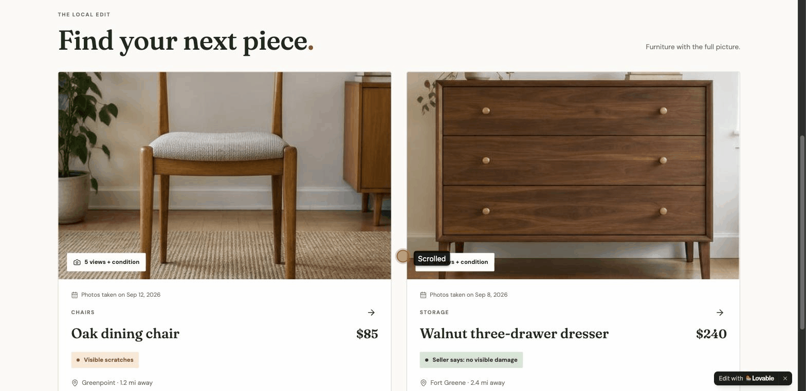

# ReNest — Full Stack PM Week, Camila Mamani

ReNest is a fictional local marketplace for second-hand furniture. In one week, I took one ReNest problem from a raw idea to a prioritized, delivery-ready MVP, and presented it in a short video.

**The problem:** buyers can't tell if a used item is worth contacting the seller about, so good listings go stale and buyers leave.

## 🎬 See it

* **Final presentation (4 min):** https://www.youtube.com/watch?v=g4Ymv-RAy3Q
* **Clickable prototype:** https://re-nest-peek.lovable.app (a quick AI-made prototype to show the MVP idea, not a real build)

## The week

| Day | Step | Doc |
| --- | --- | --- |
| 1 | **Framed:** problem statement, persona (Greg), North Star, value proposition | [problem-frame.md](deliverables/problem-frame.md) |
| 2–3 | **Scoped:** mini-PRD, 10 candidate features, first MVP | [mini-prd.md](deliverables/mini-prd.md) |
| 4 | **Prioritized:** RICE, MoSCoW, Value vs Effort, confirmed MVP | [prioritization.md](deliverables/prioritization.md) |
| 5 | **Delivery-ready:** acceptance criteria, top 3 risks, go / no-go | [delivery-plan.md](deliverables/delivery-plan.md) |
| 5 | **Presented:** the story of the video | [video-outline.md](deliverables/video-outline.md) |

## How I worked

I used AI tools (Claude, Codex, Gemini and Lovable) to organize my ideas, make visuals and build the prototype. I gave Claude and Codex the same information on purpose, so each one could catch what the other missed. But I never just accepted what they said. I checked their work against my own docs:

* The Gemini roadmap image made up 2 features that weren't in my PRD, used wrong names, and showed only 3 of my 5 MVP features. I remade it with the exact names from my PRD.
* Another AI's video script had no rollback trigger and no "what's next." I added both, using lines from my own outline.

I also made my thinking visible in every doc, with callouts for **assumptions**, **open questions**, **risks** and **recommendations**. That way I'm not only challenging the ideas, I'm also communicating what I'm still unsure about.

## My process: top moments

Three moments where my first try was wrong, and how I fixed it:

1. **Acceptance criteria.** My first "Then" was *"Greg decides to contact the seller."* QA can't test a decision, and that's a metric, not the feature working. I changed it to something anyone can see: *"the page shows the photo with a 'Damage' label."*
2. **Rollback trigger.** First I wanted to turn the damage step off if sellers lie. But turning it off doesn't stop lying; Greg just gets less truth. So lying means "pause and investigate," and the rollback is for sellers leaving (listing completion rate).
3. **"No visible damage."** I chose *"Seller says: no visible damage"* instead of *"No visible damage,"* because it's the seller's claim, not ReNest's.

The full log, with every draft and mistake: [logsOfProcess.md](logsOfProcess.md)

## What I learned

* **The hardest part was acceptance criteria:** writing a "Then" that QA can actually see and test, not what the user decides or feels.
* **My mentor told me to challenge requirements, not just follow them.** I did it when another AI said my Reach and Confidence for #4 contradict each other. I didn't just accept it: Reach stays high because the damage step is required, and the low confidence is about sellers lying, not skipping.
* **My mentor told me to talk about the user, not technical stuff.** I did it by adding a glossary to every doc, so designers, devs and QA understand terms like North Star, guardrail or acceptance criteria.
